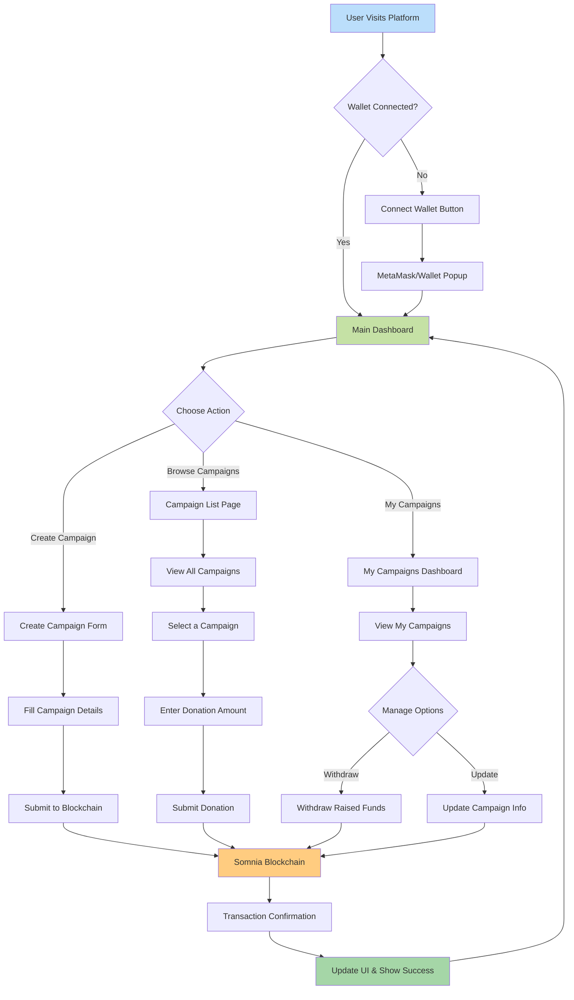

# About the project
SomniaDonate is a decentralized donation platform built on Somnia testnet that uses an intelligent matching algorithm to connect donors with charities aligned to their values, ensuring complete transparency through blockchain technology and smart contracts.

# SomniaDonate - Decentralized Donation Platform

<div align="center">


**A transparent, blockchain-powered crowdfunding platform built on Somnia network**

[Live Demo](https://somnia-donate.vercel.app/) • [Report Bug](https://github.com/simranjitsingh1337/somnia-donate/issues) • [Request Feature](https://github.com/simranjitsingh1337/somnia-donate/issues)

</div>

---

## 🌟 Overview

Somnia Donate is a Web3-powered crowdfunding platform that enables transparent, trustless donations through blockchain technology. Users can create fundraising campaigns, donate to causes they care about, and track all contributions with complete transparency on the Somnia blockchain.

### Why Somnia Donate?

- ✅ **100% Transparent** - All transactions recorded on-chain
- ✅ **No Middlemen** - Direct peer-to-peer donations
- ✅ **Low Fees** - Efficient Somnia blockchain
- ✅ **Global Access** - Anyone with a wallet can participate
- ✅ **Immutable Records** - Tamper-proof campaign data

---

## ✨ Key Features

### For Campaign Creators
- **Create Campaigns** - Launch fundraising with title, description, target amount, and deadline
- **Real-time Tracking** - Monitor donations and progress towards goals
- **Withdraw Funds** - Access raised funds directly to your wallet
- **Campaign Dashboard** - Manage and update campaign details

### For Donors
- **Browse Campaigns** - Explore active fundraising initiatives
- **Instant Donations** - Contribute using cryptocurrency via wallet
- **Transparent History** - View all donations and campaign progress
- **Blockchain Verification** - Verify every transaction on-chain

---

## 🛠 Technology Stack

**Frontend**
- Next.js 14 - React framework with App Router
- TypeScript - Type-safe development
- Tailwind CSS - Utility-first styling
- Shadcn/UI - Modern component library

**Web3 Integration**
- Ethers.js / Viem - Blockchain interaction
- Wagmi - React hooks for Ethereum
- RainbowKit / Web3Modal - Wallet connection
- Somnia Network - Layer-1 blockchain

**Deployment**
- Vercel - Frontend hosting
- IPFS (optional) - Decentralized storage

---

## 🏗 System Architecture

### High-Level Architecture


### Application Flow



### Donation Process Flow


### Data Flow Architecture


## 🚀 Getting Started

### Prerequisites

- Node.js 18 or higher
- MetaMask or compatible Web3 wallet
- Basic understanding of cryptocurrency

### Installation

1. **Clone the repository**
```bash
git clone https://github.com/simranjitsingh1337/somnia-donate.git
cd somnia-donate
```

2. **Install dependencies**
```bash
npm install
```

3. **Configure environment variables**
  - Create a **.env.local** file
```env
NEXT_PUBLIC_CONTRACT_ADDRESS=your_contract_address
NEXT_PUBLIC_SOMNIA_RPC_URL=your_rpc_url
NEXT_PUBLIC_CHAIN_ID=your_chain_id
```

4. **Run Development Server**
```bash
npm run dev
```

5. **Open Browser**
```text
Navigate to http://localhost:3000
```

## 📖 Usage Guide

### Creating a Campaign

1. Connect your Web3 wallet (MetaMask recommended)
2. Click "Create Campaign" button
3. Fill in campaign details:
   - Campaign title
   - Detailed description
   - Target funding amount
   - Campaign deadline
4. Submit and confirm the transaction in your wallet
5. Share your campaign link with supporters

### Making a Donation

1. Browse available campaigns on the homepage
2. Click on a campaign to view details
3. Enter your donation amount
4. Confirm the transaction in your wallet
5. Receive confirmation and transaction hash

### Managing Campaigns

Campaign owners can:
- View real-time donation statistics
- Track progress towards funding goals
- Withdraw collected funds after reaching milestones
- Update campaign information as needed

---

## 🤝 Contributing

Contributions are welcome! Follow these steps:

1. Fork the repository
2. Create a feature branch (`git checkout -b feature/AmazingFeature`)
3. Commit changes (`git commit -m 'Add AmazingFeature'`)
4. Push to branch (`git push origin feature/AmazingFeature`)
5. Open a Pull Request

### Development Guidelines

- Follow TypeScript best practices
- Ensure code is properly formatted
- Test thoroughly before submitting PR
- Update documentation for new features
- Write clear commit messages

---

## 🔒 Security

- Never share private keys or seed phrases
- Test on testnet before mainnet deployment
- Verify all transactions before confirming
- Report security issues responsibly
- Use environment variables for sensitive data

---

## 🐛 Known Issues

- None currently reported

Found a bug? Please [open an issue](https://github.com/simranjitsingh1337/somnia-donate/issues)

---

## 📄 License

This project is licensed under the MIT License - see the [LICENSE](LICENSE) file for details.

---

## 🙏 Acknowledgments

- [Somnia Network](https://somnia.network/) for blockchain infrastructure
- [Shadcn/UI](https://ui.shadcn.com/) for beautiful UI components
- [Wagmi](https://wagmi.sh/) for Web3 React hooks
- [Vercel](https://vercel.com/) for hosting platform
- The Web3 community for continuous support and inspiration

---

## 📞 Contact

**Simranjit Singh**

- GitHub: [@simranjitsingh1337](https://github.com/simranjitsingh1337)
- Project Link: [https://github.com/simranjitsingh1337/somnia-donate](https://github.com/simranjitsingh1337/somnia-donate)
- Live Demo: [https://somnia-donate.vercel.app/](https://somnia-donate.vercel.app/)

---

## ⭐ Support

If you find this project helpful, please consider giving it a star on GitHub!

---

<div align="center">

**Made with ❤️ by [Simranjit Singh](https://github.com/simranjitsingh1337)**

</div>
